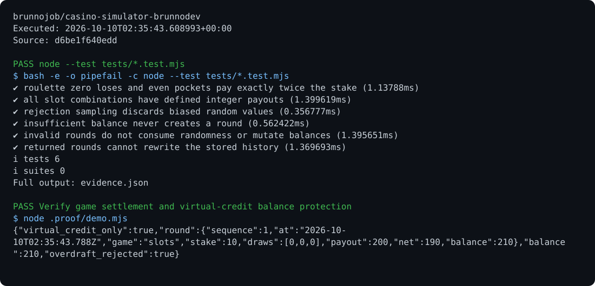

# NOVA Play

An entertainment application with separate roulette, dice, and slot rules, random sampling without modulo bias, and exportable history.

## Run

Requirements: JavaScript ESM.

```sh
node --test tests/*.test.mjs
python -m http.server 8080
```

## Behavior

Rounds use virtual credits only. Results can be recomputed from recorded draws. Local history exports JSON for the operations archive. The project does not offer payments, withdrawals, or financial prizes.

## Optional report archive

Use the [shared operations archive client](https://github.com/brunnojob/vercel-home-telemetry-api/tree/main/cloud) to queue `result.json` under project `casino-simulator-brunnodev`. The client uses `BRUNNODEV_ACCESS_TOKEN` and retains unacknowledged reports locally.

## License

Original source and documentation are MIT licensed; see [LICENSE](LICENSE). Third-party dependencies and media retain their respective terms. Maintained by [Brunno Dev](https://brunnodev.store).

## Implementation update

Game and stake validation happens before random draws. Returned rounds contain independent draw arrays, preventing callers from rewriting session history. Run `node --test tests/*.test.mjs`.

Contribution trailer: `Co-authored-by: nyctophile <329826984+ineedfoundmyway@users.noreply.github.com>`.

## Execution proof

[](https://github.com/brunnojob/casino-simulator-brunnodev/actions/workflows/proof.yml)



[Verified run](https://github.com/brunnojob/casino-simulator-brunnodev/actions/runs/38017525930) · [Execution report](docs/proof/evidence.json)

Run `python .proof/record.py` after installing the prerequisites above. The scenarios execute repository code and verify exit codes and expected output. CI publishes `execution-proof` with the transcript, input fingerprints and source commit. The downloadable report identifies the exact tested version; the workflow badge tracks the latest run.
